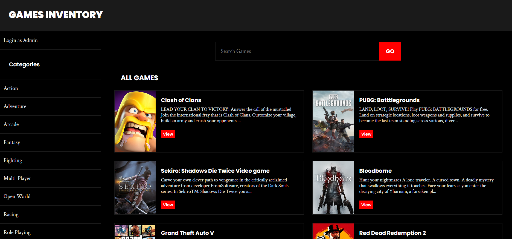
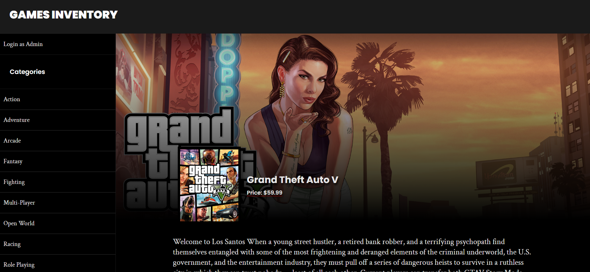
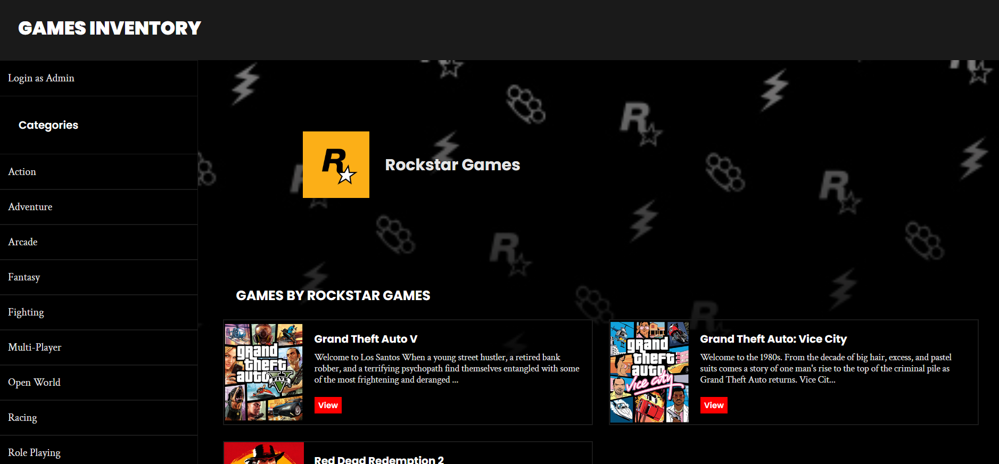
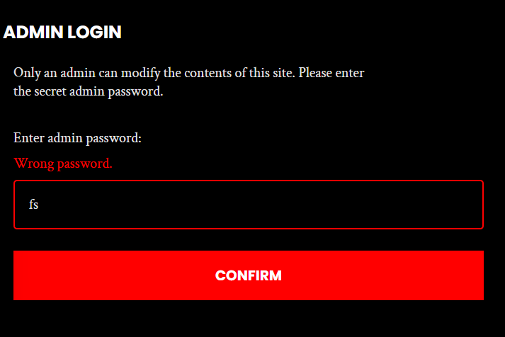
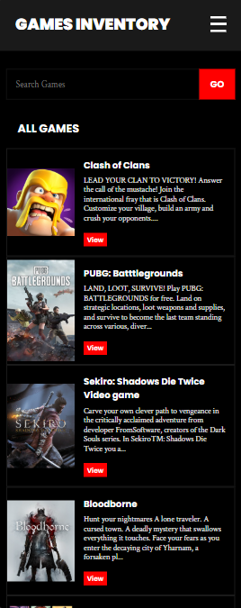
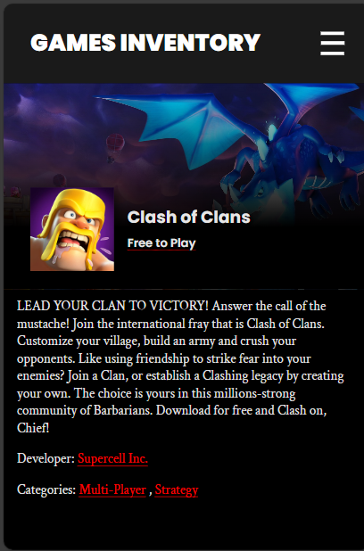

# Games inventory

A simple app to make and manage a list of your favorite games.

Live Preview: https://games-inventory-app.up.railway.app/

## Features

- Add, remove or delete any game, category or a game developer.
- Only an admin can modify the content of the page.
- Login-logut feature for the admin.
- Search all games or games in category or games by a developer.
- Pagination for games and developers list.
- Proper error handling.
- Works on all screen sizes (responsive).
- Accessible for all users (Web accessiblity principles followed).

## Tech-stack used

- NodeJs + ExpressJs on Backend.
- PostgresSQL as the database.
- EJS view engine to handle front-end rendering.
- Vanilla CSS for styling (BEM naming convention followed).
- MVC design pattern is followed for better code management.

## Screenshots

## Credits

- [The Odin Project](https://www.theodinproject.com/lessons/node-path-nodejs-inventory-application) for the assignment.
- [Railway.app](https://railway.app) for hosting.
